# Calendar Function(Vue3 + JS + HTML/CSS )

1. **달력표시**

2. **월별 데이터에 따른 달력의 정보 표시 변경**
   
   
   

## 1.달력표시

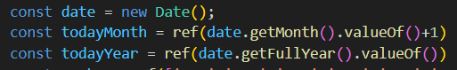

우선적으로 달력에 표시할 데이터를 받아와 보았다.

JS에 Date에 인스턴스를 받아 todayMonth에 getMonth().valueOf()를 통해 현재 달의 정보를 받아오는데 Date 객체에 월 정보가 0부터 시작하여 valueOf를 통해 Integer(Number)형으로 형 변환 후 +1을 통해 달 정보를 맞춰주었다.

또한 Vue3의 ref()를 사용하여 값을 받았는데 이는 추후 월별 데이터가 달라질 수 있어 변수를 재사용하고, watch 함수를 통해 해당 값의 변경점이 있다면 특정 로직을 동작하게 할 수 있을수도 있게 하기 위함이였다.

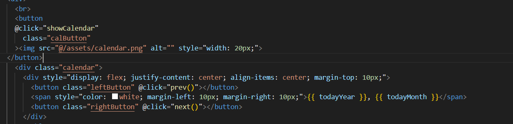

다음은 HTML부분에 해당 코드를 추가하였다. 보통 Calender라는 기능의 특성상 버튼을 누르면 그때 달력 정보가 나오는 부분이 대부분이기에 버튼에 클릭 이벤트를 주고 달력을 표시할 박스를 absolute로 두어 해당 버튼 밑에 배치하였다.

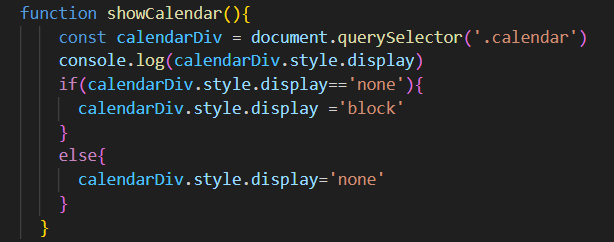

클릭 이벤트에 다음 로직을 두어 DOM으로 calendar 클래스를 선택 버튼을 누르면 block 그렇지 않으면 none으로 요소의 가시성을 바꾸어 주었다.

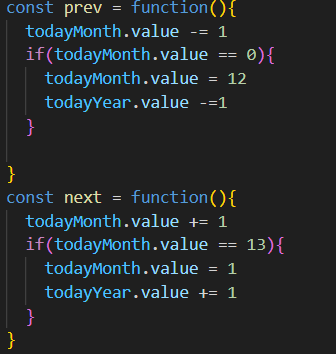

캘린더 안에도 버튼을 두어 prev()를 통해 이전달로 next()를 통해 다음 달의 정보를 받을 수 있도록 하고자 설계하였다. prev()에서는 해당 달의 정보에 1을 빼고 이 정보가 0이 되면 달 정보를 12로 년정보를 -1 해주는 로직, 그리고 next()는 이와 반대로 13이 되면 해당 달 정보를 1로 년에 1을 더해주는 로직을 적용하였다.

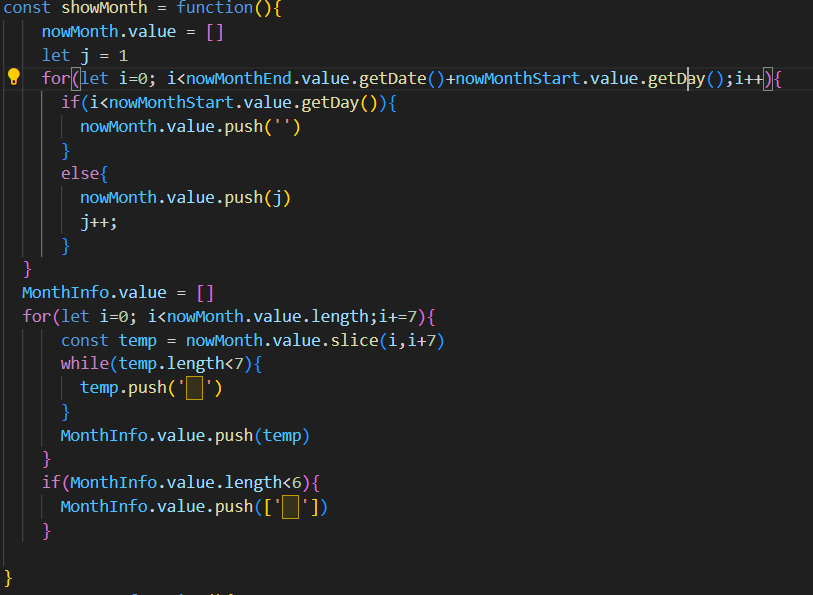

위의 코드가 사실 달 정보 표시에 가장 중요한 코드라고 할 수 있다.

nowMonth라는 현재 달 정보 전체를 받는 배열을 만들고 해당 코드 밖에 설정해 둔 nowMonthEnd(지금 달 정보에 +1을 하고 일수를 0으로 지정하면 지금 달의 마지막 일 정보)와 nowMonthStart(지금 달 정보에 일수를 1로 지정)이를 통해 해당 달이 무슨 요일부터 시작하는지와 몇일까지 존재하는지를 알 수 있었다.

반복문을 nowMonthEnd.value.getDate()+nowMonthStart.value.getDay()까지 한 이유는 마지막 일자에 시작한 요일을 더하여 달력 전체의 크기 비율을 고정적으로 하기 위함이고 

반복문을 돌며 i가 해당 시작 요일보다 작으면 빈칸을 넣어 크기를 맞춰주어 html의 테이블에 맞는 요일에 들어갈 수 있게 설정하였다.

그 이후 v-for를 통해 table에서 주별 행을 반복하여 데이터를 작성하기 위해 nowMonth를 주별로 나눠주는 배열 MonthInfo를 만들어 반복문을 통해 2차원 배열로 주별 정보를 만들었고 이 정보도 마찬가지로 달의 정보가 어떻든 6주로 고정하여 테이블에서 보여줄 때 크기를 고정적으로 유지하게 만들었다.

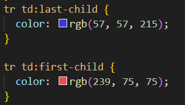

앞의 정보를 고정적으로 만들었기에 달력에서 토요일과 일요일을 표시할 때 CSS의 가상요소를 통해 손쉽게 색깔 변화를 가능하게 만들 수 있었다.

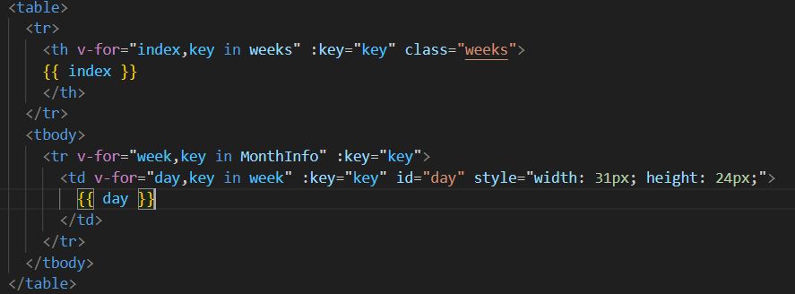

정보를 종합하여 HTML 구성을 이와같이 하여 현재 달의 정보를 표출할 수 있었다.

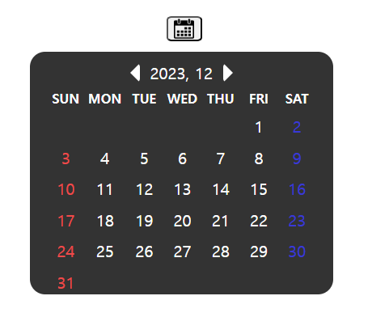

## 2.월별 데이터에 따른 정보 표시 변경

앞의 next() 함수와 prev()함수를 통해 내가 보고 있는 월의 숫자를 변경하는 로직을 만들었다. 따라서 데이터에 따른 정보를 변경하는 것은 간단하였다.

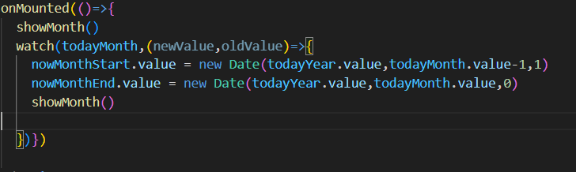

Vue의 watch 함수를 통해 해당 달 정보(ref로 구성한 이유)를 감시하고 이의 정보가 변경될 때 보고있는 달의 시작일과 끝일을 새로운 객체로 받아주고 showMonth()를 반복하여 보여주는 데이터를 변경시켰다.

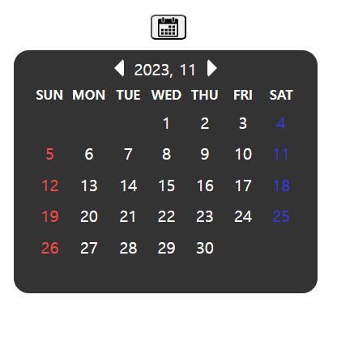

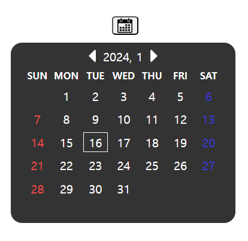

또 Css 가상요소  hover를 통해 해당 일에 마우스를 올릴 시 border 1px solid white를 적용해보았다.

# 결론

기본적인 Web의 간단한 기능인 Calendar를 직접 구현해봄으로 다음에 예약 시스템 같은 기능을 만들 때 기본이 되지 않을까 한다. 또 다른 프레임워크에서 Calendar 기능을 만들어 놓은 경우가 많지만 직접 이를 구성해봄으로 내부의 로직을 더 잘 이해할 수 있고 기능을 구현할 때 더 자세히 요소를 거들 수 있어 좀 더 클라이언트 요구에 맞는 기능이나 디자인을 커스텀하여 구현할 수 있지 않을까 싶고, 일단 기본적으로 재밌었다.
